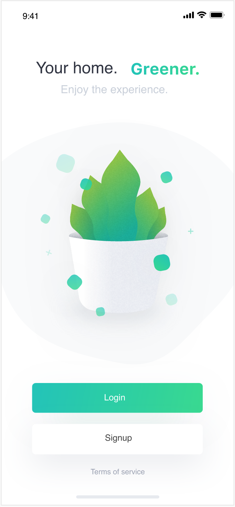

<div align="center">
    
</div>

# MyRootsIn

This project is a mobile app for a social cause project to join UN in building the great green wall and it is built using [React Native](https://facebook.github.io/react-native/).

MyRootsIn app allows for a user to create an account and then choose to plant a tree, in-person or remotely. The user can then choose a location, either to be part of the great green wall or any other location.

```
If more people can plant green and join in the green economy, we would have a better chance at saving mother earth - MyRootsIn
```